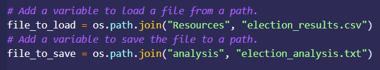
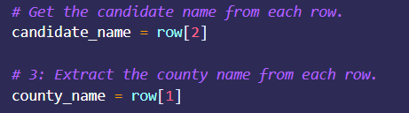
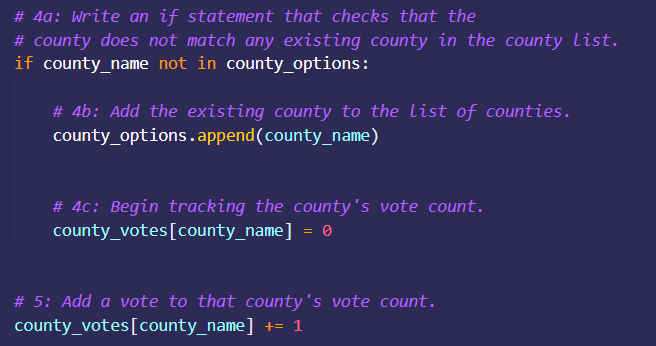
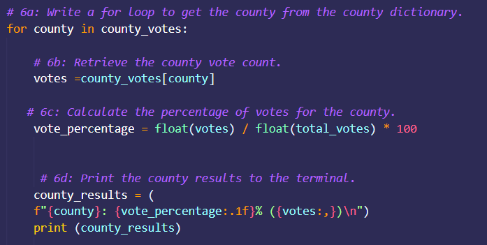

# 🚀 Election_Challenge
Challenge Week3 Data Analysis BootCamp using Python
## ⚡Overview of Election Audit: 
Assist Tom and Seth from the Colorado Board of Elections with the results of recent elections. They need to know the total number of votes, a list of the candidates with the corresponding number of votes and percentages, votes per county and determine the winner of the election.
## ⚡Election-Audit Results: 
**Total Votes in the Election:** 
 - 369,71.

**County Votes:**

  - Jefferson has 10.5% of percentage and 38,855 of total votes.

  - Denver has 82.8% of percentage and 306,055 of total votes.

  - Arapahoe has 6.7% of percentage and 24,801 of total votes.

**Largest County Turnout:** 
 - Denver.

**Candidate Votes:**

  - Charles Casper Stockham has 23.0% of percentage and 85,213 of total votes.

  - Diana DeGette has 73.8% of percentage and 272,892 of total votes.

  - Raymon Anthony Doane has 3.1% of percentage and 11,606 of total votes.

**Election Results:**

  - Candidate **Diana DeGette** won the election, with **272,892** of total votes and a percentage of **73.8%.**

## ⚡Election-Audit Summary:
This script can be easily modified to find the results of any election like this one that has 3 different columns (Ballot ID, County, and Candidate Voted for). First, it is important to change the path of the csv file that contains the data and the path of the text file where the results will be printed for better visualization:

 

Second, make sure that counties and candidates are in the correct index:

 

Also, you can still use this script as a template if the file that contains the data has more information, such as the city, postal code etc. They can be added to the analysis by extracting that characteristic from the correct index, use an accumulator to count and write the same decision and repetition statements. It is important to make sure to print correctly. This script is great for a small election analysis, but it can definitely grow to an audit of a presidential election.

 
 

